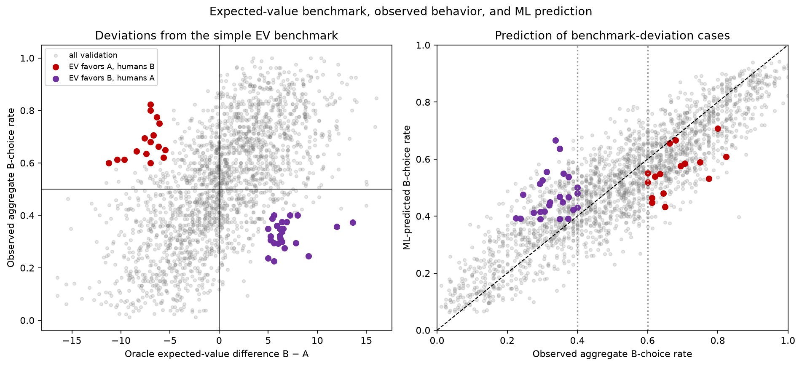

# DecisionLab

DecisionLab is a reproducible machine-learning study of aggregate human choice
under risk and uncertainty. Given the structure of two gambles, the project
predicts `bRate`: the proportion of choices assigned to Gamble B for a
problem-condition row in choices13k.

The project asks three practical questions:

1. How accurately can decision structure predict aggregate choice rates?
2. Where does observed behavior depart from a simple expected-value benchmark?
3. How are expected value, risk, ambiguity, feedback, and lottery structure
   associated with model predictions and errors?

This is an aggregate prediction task. DecisionLab does **not** predict an
individual person's choice, infer individual utility, or estimate causal
effects.

## Why the evaluation is group-based

choices13k contains 14,568 condition rows representing 13,006 decision
problems. Of these problems, 1,562 appear twice: once without feedback and once
with feedback, using the same gamble structure.

A random row split can therefore train on one condition and evaluate on the
same underlying problem under another condition. In the repository's
deterministic leakage demonstration, ordinary row splitting placed **706**
repeated structures across partitions.

DecisionLab instead assigns a structural fingerprint to each problem using the
complete gamble distributions and design variables. All rows sharing either a
problem ID or exact structure remain in the same partition.

| Partition | Rows | Structural groups |
|---|---:|---:|
| Train | 10,237 | 9,138 |
| Validation | 2,194 | 1,953 |
| Locked test | 2,137 | 1,915 |

The primary metric is unweighted problem-row MAE. Participant-count-weighted
metrics are reported only as sensitivity analyses because `n` describes target
measurement precision, not the primary prediction unit. The test split has not
been scored; all results below are grouped validation results used during model
selection.

## Data and target

`bRate` is the mean participant-level rate of selecting Gamble B. Each
participant completed five trials for a problem, so the target is continuous in
`[0,1]`; it is not an individual binary response. Participant counts range from
15 to 33 per row.

Raw files are downloaded from a commit-pinned public repository, verified by
SHA-256, made read-only, and never modified in place. The JSON file is joined by
its documented zero-based CSV row key rather than by `Problem` ID.

## Features and leakage controls

The model uses 28 behaviorally interpretable features derived from validated
design variables:

- expected values and the B-minus-A expected-value difference;
- payoff ranges, extrema, and probability-weighted dispersion;
- best-payoff and loss probabilities;
- ambiguity and feedback indicators;
- lottery-shape and correlation encodings;
- two prespecified EV interactions with ambiguity and feedback.

Feature construction deliberately excludes `bRate`, `bRate_std`, participant
count `n`, `Block`, and identifiers. Schema validation eliminates the need for
imputation; scaling where required and all model fitting use training data only.
Ten features use objective Gamble B probabilities that participants could not
observe under ambiguity; results using them are therefore labeled
**design/oracle predictions**.

Mathematical definitions and per-feature leakage assessments are in
[docs/features.md](docs/features.md).

## Model results

All values in this table were generated by the saved validation experiments.

| Model | Purpose | MAE | RMSE | R² |
|---|---|---:|---:|---:|
| Training mean | Outcome-free reference | 0.1834 | 0.2214 | −0.0000 |
| Hard expected-value rule | Normative benchmark | 0.3599 | 0.4044 | −2.3371 |
| Ridge regression | Interpretable linear model | 0.1159 | 0.1451 | 0.5706 |
| Shallow decision tree | Low-complexity nonlinear model | 0.0952 | 0.1202 | 0.7052 |
| Gradient Boosting | Tuned ensemble candidate | 0.0831 | 0.1047 | 0.7762 |
| **Random Forest** | **Selected model** | **0.0809** | **0.1012** | **0.7910** |

The selected Random Forest also achieved grouped training-CV MAE
`0.0825 ± 0.0015` across five folds. Its participant-count-weighted validation
MAE was `0.0807`, close to the primary unweighted result.

Random Forest was selected because it had the lowest validation MAE, stable
grouped-fold performance, and a simpler training structure than the sequential
Gradient Boosting alternative. Hyperparameter search was deliberately modest
and confined to grouped training folds.

### What the expected-value baseline teaches

The hard benchmark predicts B with probability 1 when `EV(B) > EV(A)`, A with
probability 1 when `EV(A) > EV(B)`, and 0.5 for a tie. Its MAE of `0.3599` is
worse than the training-mean baseline because aggregate human choice rates are
usually not deterministic 0-or-1 outcomes.

This does not imply that expected value lacks predictive information. When used
continuously alongside payoff and probability structure, expected-value
features form the model's strongest permutation-importance domain. The useful
lesson is that EV is informative but an EV-maximizing hard rule is too coarse
to represent aggregate behavior.

## Behavioral interpretation

Grouped validation permutation importance measures how much MAE increases when
a behaviorally related feature domain is disrupted:

| Feature domain | Mean MAE increase |
|---|---:|
| Expected value | 0.0856 |
| Payoff and risk | 0.0432 |
| Probability structure | 0.0345 |
| Ambiguity | 0.0019 |
| Lottery structure | 0.0014 |
| Feedback | 0.0001 |


These values describe model reliance, not isolated feature effects. Correlated
engineered features can divide or duplicate importance.

Additional validation diagnostics found:

- near-equal expected values (`|EV(B) − EV(A)| ≤ 1`) had the highest EV-regime
  MAE, `0.0886`;
- ambiguous-B rows had MAE `0.0837`, compared with `0.0803` for known
  probabilities;
- coherently switching ambiguity on changed the mean model prediction by
  `+0.0408`, while switching feedback on changed it by `+0.0063`;
- 349 validation rows had observed aggregate choice within 0.05 of a 50/50
  split; their MAE was `0.0774`.

The normative analysis describes disagreement with EV as a deviation from a
simple benchmark—not as irrationality. Full results and reconstructed examples
are in [reports/behavioral_analysis.md](reports/behavioral_analysis.md) and
[reports/error_analysis.md](reports/error_analysis.md).



## Interactive research dashboard

The Streamlit application lets a user construct a supported risky-choice
problem and displays:

- both gamble distributions and their expected values;
- the simple expected-value benchmark;
- predicted aggregate Gamble B choice rate;
- global model-driver domains;
- coherent feedback and ambiguity what-if comparisons;
- warnings when engineered values fall outside the training range.

The UI calls the same production feature engineering and serialized model
pipeline used in experiments; feature formulas are not duplicated in the app.

## Limitations

- Reported performance is validation performance after model selection. The
  locked test set remains unscored.
- Broad EDA was performed before the final split existed, so the locked test set
  is not untouched with respect to general exploratory knowledge.
- Oracle probability features limit the interpretation of ambiguous scenarios:
  they represent analyst-known design information, not participant-visible
  information.
- Feedback is represented as a condition indicator; realized experience
  histories are unavailable.
- Predictions describe aggregate rates for choices13k-style problems and do not
  transfer automatically to individuals, new populations, or high-stakes
  decisions.
- Permutation importance, partial dependence, subgroup errors, and what-if
  comparisons are predictive associations or model sensitivities—not causal
  estimates.
- The application reports dataset-level validation error, not a calibrated
  uncertainty interval for a constructed scenario.

## Reproduce the project

Python 3.12 or newer and internet access are required for the initial install
and dataset download. Run commands from the repository root.

```bash
python3 -m venv .venv
source .venv/bin/activate
python -m pip install -r requirements-dev.lock
python -m pip install --no-build-isolation --no-deps -e .

decisionlab-fetch-data
decisionlab-validate-data --output artifacts/manifests/data_validation_summary.json
decisionlab-eda
decisionlab-build-features
decisionlab-create-splits
decisionlab-run-baselines
decisionlab-select-model
decisionlab-behavioral-analysis
decisionlab-error-analysis

python -m pytest
ruff check .
ruff format --check .
python -m pip check

streamlit run app.py
```

The analysis commands regenerate local data, experiment artifacts, reports, and
the selected pipeline. Production prediction tests intentionally run after
those artifacts exist. See [docs/application.md](docs/application.md) for the
application contract and [docs/evaluation_protocol.md](docs/evaluation_protocol.md)
for the complete split and metric rationale.

## Repository layout

```text
configs/             reproducible data, split, experiment, and analysis settings
data/                immutable raw data and regenerated processed tables
src/decisionlab/     validation, features, splitting, models, analysis, and app services
tests/               data contracts, formulas, leakage, serialization, and prediction tests
artifacts/           machine-readable provenance, predictions, metrics, and models
reports/             generated research reports, figures, and comparison tables
docs/                data, feature, evaluation, and application contracts
```

## Citation

DecisionLab uses choices13k from:

Peterson, J. C., Bourgin, D. D., Agrawal, M., Reichman, D., & Griffiths,
T. L. (2021). Using large-scale experiments and machine learning to discover
theories of human decision-making. *Science, 372*(6547), 1209–1214.
https://doi.org/10.1126/science.abe2629

Dataset repository: https://github.com/jcpeterson/choices13k, pinned here to
commit `821ae7e88386b508ebb46fae76fac63cb62ec876`.
