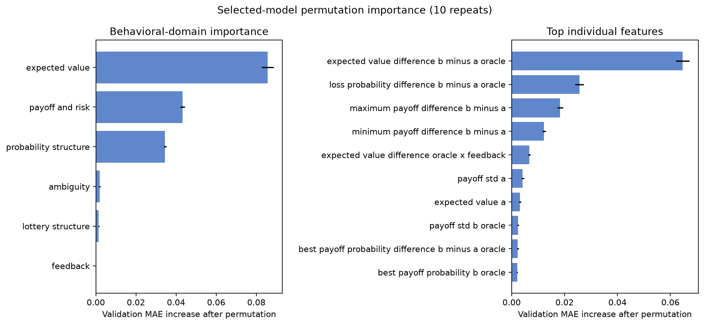

# DecisionLab

DecisionLab is a reproducible machine-learning study of aggregate human choice under risk and
uncertainty. Given the structure of two gambles, it predicts the aggregate rate at which
participants select Gamble B and compares observed behavior with a simple expected-value
benchmark.

**v0.2.1 is the current portfolio-ready release.** See [the release history](docs/releases.md) for
the status of earlier checkpoints. v0.1.0 is a historical pre-methodology-fix checkpoint and is
not the current implementation.

## At a glance

| | |
|---|---|
| **Dataset** | 14,568 condition rows representing 13,006 risky-choice problems from choices13k |
| **Target** | `bRate`, the aggregate rate of selecting Gamble B, bounded in `[0, 1]` |
| **Evaluation** | 5 × 5 nested grouped cross-validation with complete outer out-of-fold predictions |
| **Primary metric** | MAE averaged equally across structural decision problems |
| **Official headline** | Inner-selected Random Forest equal-problem MAE: **0.0800** |
| **Scope** | Aggregate human choice rates—not individual or personalized predictions |
| **Demo** | [Launch the tracked Streamlit dashboard locally](#interactive-demo) |



The figure summarizes model reliance under grouped perturbations that preserve engineered-feature
dependencies. Importance is predictive and non-causal; overlapping domains should not be added or
read as isolated effects.

## What DecisionLab studies

DecisionLab asks:

1. How accurately can decision structure predict aggregate choice rates?
2. Where does observed behavior depart from a simple expected-value benchmark?
3. How are expected value, risk, ambiguity, feedback, and lottery structure associated with model
   predictions and errors?

`bRate` is the mean participant-level rate of selecting Gamble B for a problem-condition row. Each
participant completed five trials for a problem, so the target is continuous rather than an
individual binary choice. DecisionLab does not infer individual utility or estimate causal effects.

## Official results

The current official estimates come from complete outer out-of-fold predictions generated by the
prespecified nested procedure. All rows are development data: these are leakage-controlled
generalization estimates, not results from an untouched confirmatory holdout.

| Official nested outer-OOF procedure | Primary: equal-problem MAE | Secondary: condition-row MAE | Secondary: participant-count-weighted MAE |
|---|---:|---:|---:|
| **Random Forest, inner-selected** | **0.0800** | **0.0805** | **0.0801** |
| Independently tuned Gradient Boosting | 0.0830 | 0.0836 | 0.0832 |
| Shallow decision tree | 0.0950 | 0.0958 | 0.0954 |
| Ridge regression | 0.1167 | 0.1167 | 0.1159 |
| Constant training mean | 0.1836 | 0.1839 | 0.1809 |
| Hard expected-value rule | 0.3614 | 0.3623 | 0.3646 |

For the inner-selected procedure, equal-problem outer-OOF RMSE is **0.1011**, R² is **0.7923**,
and the 95% structural-group bootstrap interval for MAE is **0.0789–0.0810**. Random Forest was
selected independently in all five outer folds using only inner grouped-CV results.

The hard expected-value rule predicts B with probability 1 when `EV(B) > EV(A)`, A with probability
1 when `EV(A) > EV(B)`, and 0.5 for a tie. It is a deliberately extreme behavioral benchmark, not
a calibrated aggregate-choice model; disagreement is not evidence of irrationality.

Current machine-readable comparisons:

- [nested model comparison](reports/tables/nested_model_comparison.csv)
- [nested baselines](reports/tables/nested_baselines.csv)
- [official model metrics](artifacts/experiments/nested_model_selection/metrics.json)

The older `baselines/` and `model_selection/` experiment directories and their partition-based
comparison tables are retained only as **stale/legacy development-era artifacts**. They are not
current performance evidence; see the [artifact status record](artifacts/experiments/STALE_ARTIFACTS.md).

## Why evaluation is group-based

Of the 13,006 problem IDs, 1,562 appear in both feedback and no-feedback conditions with the same
gamble structure. Ordinary row splitting can therefore train on one condition and evaluate on its
paired counterpart; the repository's deterministic demonstration places 706 repeated structures
across partitions.

DecisionLab groups rows by problem ID and exact structural fingerprint. Each structural group
appears in exactly one of five outer test folds. Within each outer training portion, five inner
grouped folds handle model-family and hyperparameter selection. Preprocessing is fit inside its
training fold, and the held-out outer fold is used only to produce its OOF predictions.

The primary metric computes absolute error within each structural problem group and then averages
equally across groups. Condition-row and participant-count-weighted metrics are explicitly
secondary because they answer different weighting questions.

The complete protocol is documented in [docs/evaluation_protocol.md](docs/evaluation_protocol.md).

## Behavioral interpretation

The current behavioral, normative, and error analyses use complete nested outer-OOF predictions.
The current permutation analysis moves complete structural groups only within the same outer fold,
perturbs primitive decision variables or coherent dependency families, and rebuilds dependent
features through the production feature pipeline.

Under this analysis, the complete Gamble B distribution and lottery family and the Gamble A
distribution family produced the largest predictive-reliance estimates. Ambiguity showed smaller
model reliance; feedback and correlation were smaller still. These rankings describe model
reliance under the implemented perturbation scheme—not isolated psychological effects or causal
mechanisms.

Expected-value maximization is used only as a simple benchmark. The reports identify aggregate
deviations from that benchmark, divided-choice cases, successful predictions, and representative
failures without labeling human decisions irrational.

- [Behavioral analysis](reports/behavioral_analysis.md)
- [Systematic error analysis](reports/error_analysis.md)
- [Grouped permutation tables](artifacts/analysis/behavioral/)

## Interactive demo

The checked-in Streamlit app currently uses the provenance-verified official production pipeline,
its exact 28-feature contract, the current grouped dependency-preserving behavioral statistics,
and tracked application metadata containing training-feature ranges. A fresh clone does not need
the raw dataset or ignored processed feature table to launch the dashboard.

The app displays both gambles, expected values, the expected-value benchmark, predicted aggregate
`bRate`, global model-driver domains, feedback and ambiguity what-if comparisons, and feature-range
warnings. Its performance display is the dataset-level outer-OOF estimate—not a calibrated
uncertainty interval for the constructed scenario.

## Quick start: launch the tracked demo

```bash
git clone https://github.com/QHN2509/DecisionLab.git
cd DecisionLab
python3 -m venv .venv
source .venv/bin/activate
python -m pip install -r requirements-dev.lock
python -m pip install --no-build-isolation --no-deps -e .
streamlit run app.py
```

Predictions are aggregate behavioral predictions, not personalized recommendations. See the
[application contract](docs/application.md) for supported inputs and interpretation limits.

## Data and features

Raw `c13k_selections.csv` and `c13k_problems.json` files are downloaded from a pinned choices13k
commit, verified by SHA-256, made read-only, and never transformed in place. The problem JSON is
joined using its documented zero-based CSV row key, not the `problem` ID.

The selected model uses 28 interpretable features derived from validated design variables:

- expected values and the B-minus-A expected-value difference;
- payoff ranges, extrema, and probability-weighted dispersion;
- best-payoff and loss probabilities;
- ambiguity and feedback indicators;
- lottery-shape and correlation encodings;
- two prespecified expected-value interactions with ambiguity and feedback.

Feature construction excludes `bRate`, `bRate_std`, participant count `n`, `Block`, and identifiers.
Ten features use objective Gamble B probabilities that participants could not observe under
ambiguity, so the corresponding results are labeled design/oracle predictions. Definitions and
feature-level leakage assessments are in [docs/features.md](docs/features.md).

## Limitations

- Broad target-aware EDA preceded the nested protocol. Outer-OOF performance is leakage-controlled
  for the frozen selection procedure but is not an independent confirmatory result unaffected by
  prior exploration.
- Oracle probability features limit interpretation under ambiguity: they represent analyst-known
  design information rather than participant-visible information.
- Feedback is represented as a condition indicator; realized experience histories are unavailable.
- Predictions describe aggregate rates for choices13k-style problems and do not automatically
  transfer to individuals, new populations, or high-stakes decisions.
- Permutation importance, subgroup errors, predictive relationships, and what-if comparisons are
  associations or model sensitivities—not causal estimates.
- The app reports the dataset-level outer-OOF error estimate, not a calibrated uncertainty interval
  for a constructed scenario.

## Reproduce the project

## Local reproduction in one worktree

After completing the environment setup under [Interactive demo](#interactive-demo), the following
commands download and validate the data, rebuild features and folds, and rerun experiments in one
worktree:

```bash
decisionlab-fetch-data
decisionlab-validate-data
decisionlab-eda
decisionlab-build-features --allow-dirty
decisionlab-create-folds
decisionlab-run-baselines --allow-dirty
decisionlab-select-model --allow-dirty
```

The explicit dirty-worktree overrides label affected runs `non_official_dirty_worktree`; they do
not weaken the provenance standard or create official replacement artifacts.

## Official provenance-controlled regeneration

Official runners require a clean committed revision. Use a dedicated branch and commit each stage
before starting the next provenance-controlled stage:

```bash
git switch -c reproduce/official

decisionlab-fetch-data
decisionlab-validate-data

decisionlab-eda
git add -A && git commit -m "Reproduce EDA"

decisionlab-build-features
git add -A && git commit -m "Reproduce features"

decisionlab-create-folds
git add -A && git commit -m "Reproduce grouped folds"

decisionlab-run-baselines
git add -A && git commit -m "Reproduce nested baselines"

decisionlab-select-model
git add -A && git commit -m "Reproduce nested model selection"

decisionlab-behavioral-analysis
git add -A && git commit -m "Reproduce behavioral analysis"

decisionlab-error-analysis
git add -A && git commit -m "Reproduce error analysis"

decisionlab-build-app-metadata
git add -A && git commit -m "Reproduce application metadata"
```

Then run the repository checks:

```bash
python -m pytest
ruff check .
ruff format --check .
python -m pip check
streamlit run app.py
```

Official runs record the clean Git revision, dataset and configuration hashes, environment lock,
fold specification, relevant implementation, inputs, and generated outputs. Implementation details
and the reason for stage-by-stage clean checkpoints are in [docs/provenance.md](docs/provenance.md).

## Repository layout

```text
configs/             reproducible data, split, experiment, and analysis settings
data/                immutable raw data and regenerated processed tables
src/decisionlab/     validation, features, splitting, models, analysis, and app services
tests/               data contracts, formulas, leakage, serialization, and prediction tests
artifacts/           machine-readable provenance, predictions, metrics, and models
reports/             generated research reports, figures, and comparison tables
docs/                data, feature, evaluation, application, and release contracts
```

## Citation

DecisionLab uses choices13k from:

Peterson, J. C., Bourgin, D. D., Agrawal, M., Reichman, D., & Griffiths, T. L. (2021).
Using large-scale experiments and machine learning to discover theories of human decision-making.
*Science, 372*(6547), 1209–1214. <https://doi.org/10.1126/science.abe2629>

Bourgin, D. D., Peterson, J. C., Reichman, D., Russell, S. J., & Griffiths, T. L. (2019).
Cognitive model priors for predicting human decisions. In *Proceedings of the 36th International
Conference on Machine Learning*, *Proceedings of Machine Learning Research, 97*, 5133–5141.
<https://proceedings.mlr.press/v97/peterson19a.html>

Dataset repository: <https://github.com/jcpeterson/choices13k>, pinned to commit
`821ae7e88386b508ebb46fae76fac63cb62ec876`.
